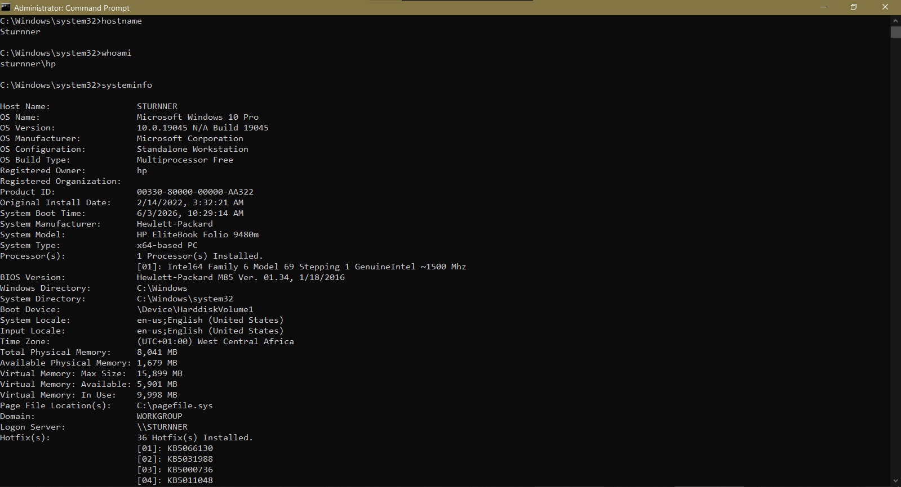
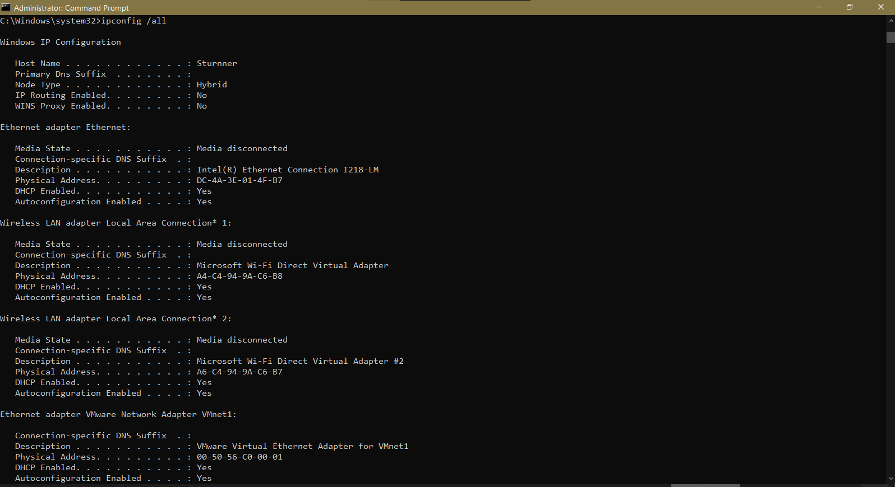
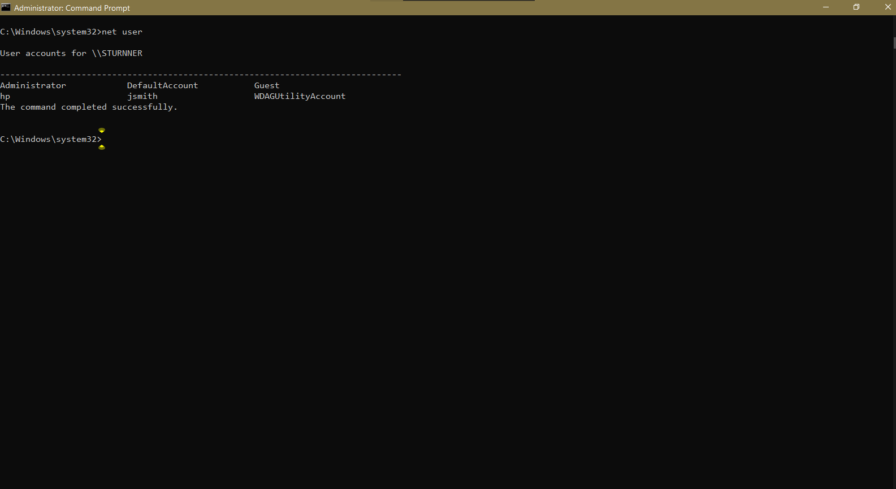
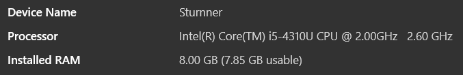
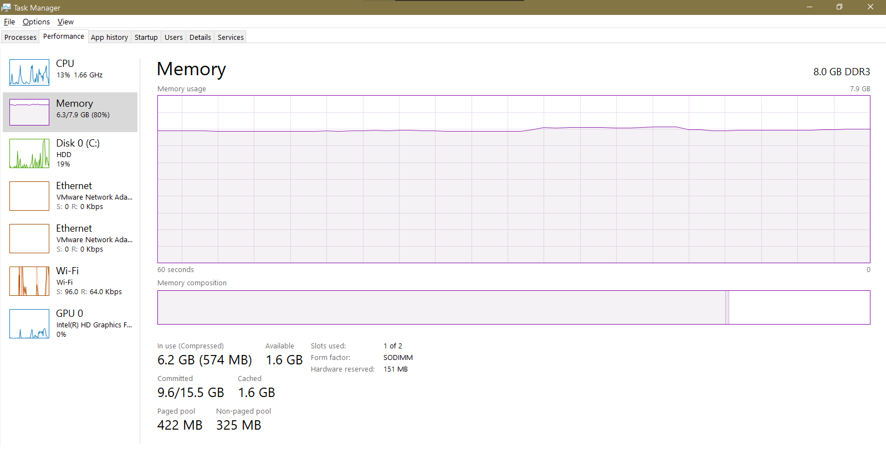
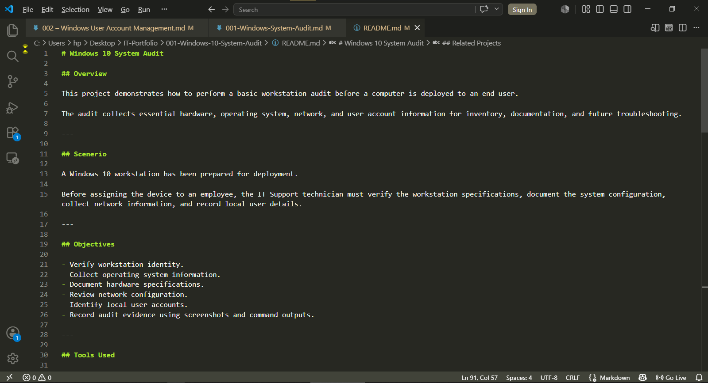

# 001 – Windows Workstation System Audit

## Scenario

A Windows 10 workstation has been prepared for deployment.

Before assigning the device to an employee, the IT Support technician must verify the workstation specifications, document the system configuration, collect network information, and record local user details.

---

## Objectives

- Identify the workstation hostname.
- Verify the logged-in user.
- Document operating system information.
- Collect network configuration details.
- Review local user accounts.
- Record workstation specifications for inventory and future troubleshooting.

---

## Tools Used

- Windows Settings
- Command Prompt
- Task Manager
- Visual Studio Code

---

## Task 1 — Identify the Workstation

### Commands

```cmd
hostname
whoami
```

### Purpose

Identify the workstation name and currently logged-in user.

### Evidence

**Output Files**

- [hostname.txt](../Outputs/hostname.txt)
- [whoami.txt](../Outputs/whoami.txt)

**Screenshots**







### Result

Successfully identified the workstation hostname and the currently logged-in local user account.

---

## Task 2 — Collect Operating System Information

### Command

```cmd
systeminfo
```

### Purpose

Collect detailed Windows operating system and hardware information.

### Evidence

**Output File**

- [systeminfo.txt](../Outputs/systeminfo.txt)

**Screenshot**



### Result

Successfully documented the workstation operating system, processor, installed memory, manufacturer, model, and system architecture.

---

## Task 3 — Review Hardware Resources

### Tool

Task Manager → Performance → Memory

### Purpose

Verify installed memory and basic hardware performance information.

### Evidence

**Output File**

- N/A (GUI-based task)

**Screenshot**



### Result

Verified installed physical memory, memory utilization, available memory, and memory slot configuration.

---

## Task 4 — Review Network Configuration

### Command

```cmd
ipconfig /all
```

### Purpose

Collect the workstation network configuration.

### Evidence

**Output File**

- [ipconfig.txt](../Outputs/ipconfig.txt)

**Screenshots**


### Result

Successfully documented the workstation network adapters, IP configuration, DNS configuration, and MAC addresses.

---

## Task 5 — Review Local User Accounts

### Command

```cmd
net user
```

### Purpose

Identify all local user accounts configured on the workstation.

### Evidence

**Output File**

- [netuser.txt](../Outputs/netuser.txt)

**Screenshot**


### Result

Successfully listed all local user accounts configured on the workstation.

---

## Findings

- Successfully identified the workstation hostname.
- Verified the currently logged-in user.
- Confirmed Windows 10 Pro (64-bit) installation.
- Documented hardware specifications.
- Verified installed memory (8 GB DDR3).
- Reviewed workstation network configuration.
- Identified configured local user accounts.
- The workstation met the baseline requirements for deployment.

---

## Lessons Learned

- Learned how to perform a basic Windows workstation audit.
- Practiced collecting system information using Command Prompt.
- Improved Windows hardware and operating system identification skills.
- Learned how to document audit findings using Markdown.
- Strengthened technical documentation practices.

---

## Recommendations

- Install all pending Windows Updates before deployment.
- Ensure Microsoft Defender is enabled.
- Confirm device drivers are up to date.
- Remove unnecessary local accounts.
- Record the workstation in the organization's asset inventory.

---

## Skills Demonstrated

- Windows Administration
- Workstation Auditing
- Command Prompt
- Windows Inventory
- Network Configuration
- Hardware Identification
- Technical Documentation
- Markdown
- Visual Studio Code

---

## Project Structure

```text
Documentation/
Outputs/
Screenshots/
README.md
```

---

## Project Documentation



---

**Project Status:** ✅ Complete