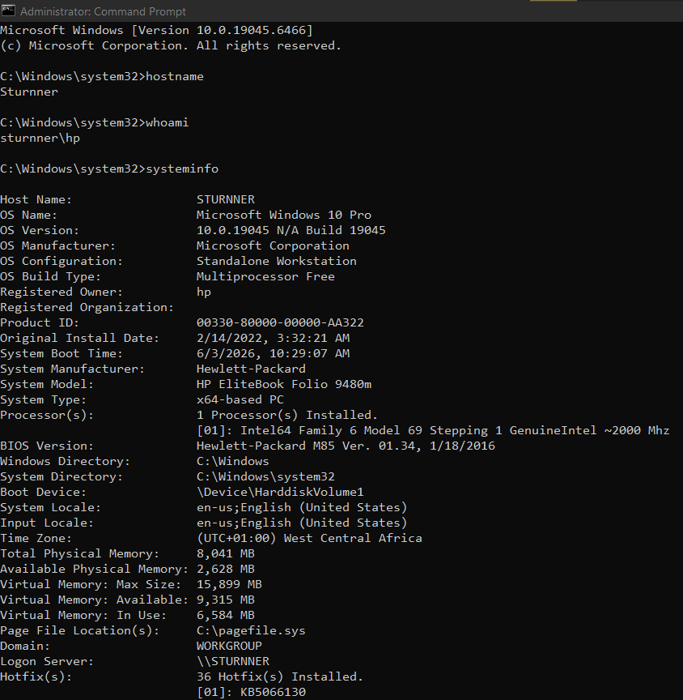
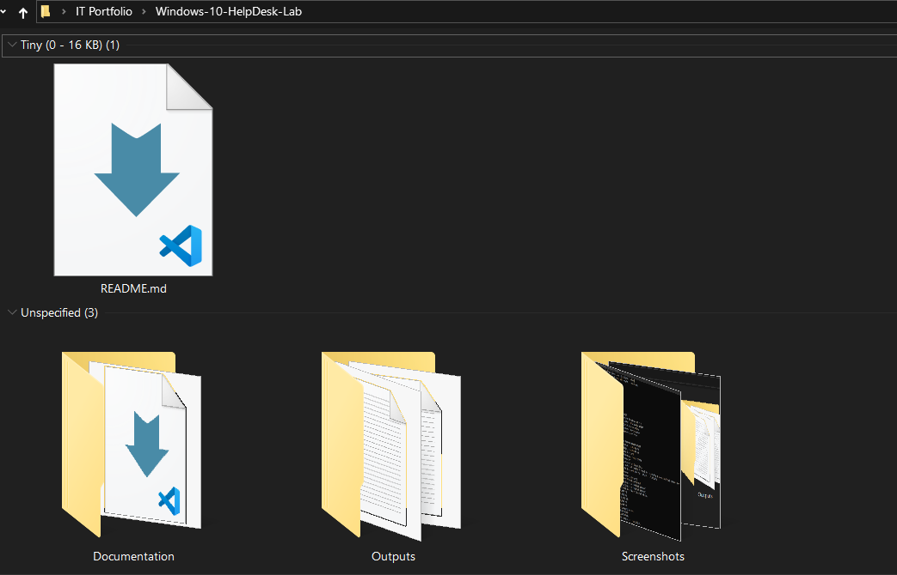
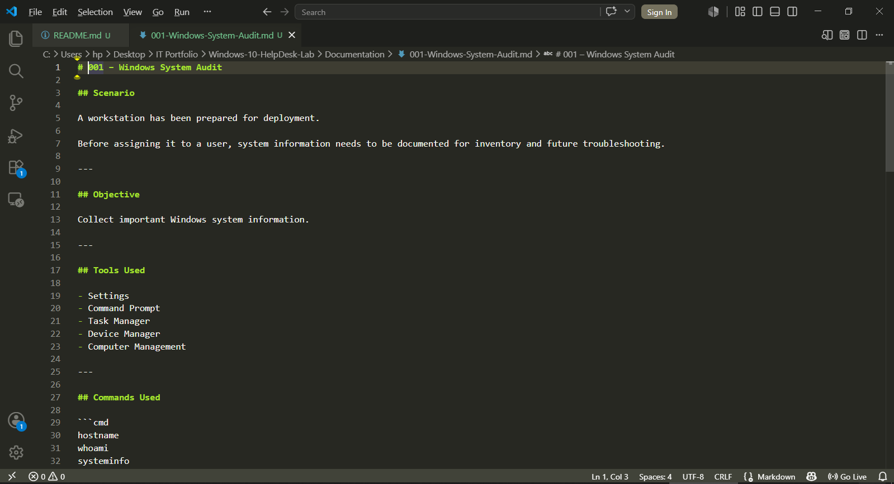
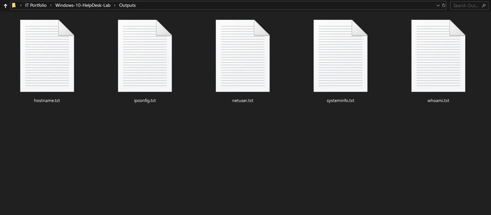

# Windows 10 System Audit

## Overview

Performed a Windows workstation audit using built-in Windows tools and Command Prompt.

---

## Skills

- Windows Administration
- Command Prompt
- System Information Collection
- Documentation

---

## Folder Structure

Documentation

Outputs

Screenshots

---

# Project Preview

## Running the Audit

---

## Project Folder Structure

---

## Technical Documentation

---

## Command Output Files

