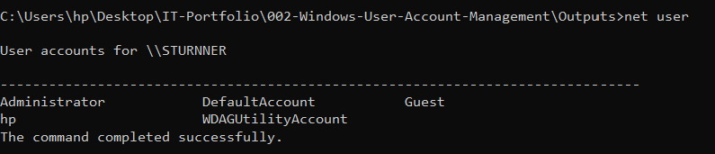
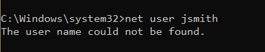
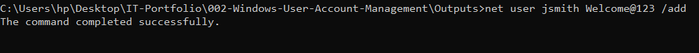
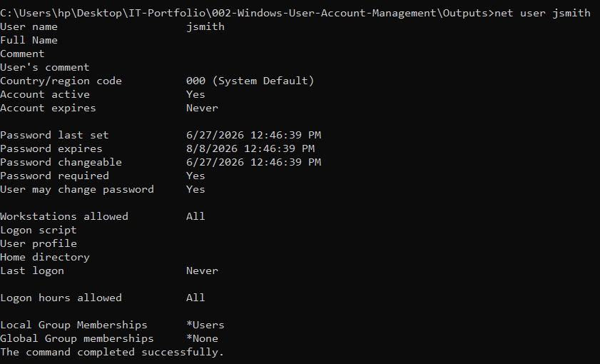
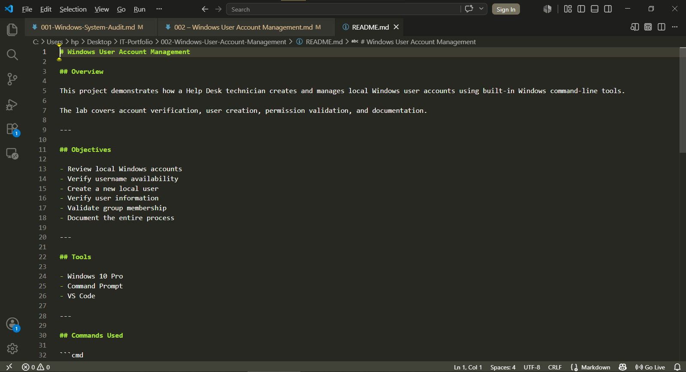

# 002 – Windows User Account Management

## Scenario

A new employee has joined the company.

Before the workstation is assigned, the IT Support technician must verify that the requested username is available, create the local user account, validate its configuration, and document all actions performed.

---

## Objectives

- Review existing local Windows user accounts.
- Verify that the requested username is available.
- Create a new local Windows user account.
- Verify the new account was created successfully.
- Confirm the default local group membership.
- Document all commands, outputs, screenshots, and findings.

---

## Tools Used

- Command Prompt
- Windows 10 Pro
- Visual Studio Code

---

## Task 1 — Review Existing Local User Accounts

### Command

```cmd
net user
```

### Purpose

Review all existing local Windows user accounts before creating a new account.

### Evidence

**Output File**

- [net-user-before.txt](../Outputs/net-user-before.txt)

**Screenshot**



### Result

Successfully reviewed all existing local Windows user accounts and established a baseline before making any account changes.

---

## Task 2 — Verify Username Availability

### Command

```cmd
net user jsmith
```

### Purpose

Verify that the requested username is available before creating a new account.

### Evidence

**Output File**

- [user-check-before.txt](../Outputs/user-check-before.txt)

**Screenshot**



### Result

Windows confirmed that the username **jsmith** does not exist, indicating the account name is available for use.

---

## Task 3 — Create a New Local User Account

### Command

```cmd
net user jsmith Welcome@123 /add
```

### Purpose

Create a new local Windows user account for the employee.

### Evidence

**Output File**

- [create-user.txt](../Outputs/create-user.txt)

**Screenshot**



### Result

Successfully created the local Windows user account **jsmith**.

---

## Task 4 — Verify User Account Configuration

### Command

```cmd
net user jsmith
```

### Purpose

Verify the account configuration, account properties, and local group membership.

### Evidence

**Output File**

- [verify-user.txt](../Outputs/verify-user.txt)

**Screenshot**



### Result

Verified that the account **jsmith** was successfully created. The account was automatically assigned to the default **Users** local group and the account properties were confirmed.

---

## Findings

- Existing local user accounts were successfully reviewed.
- Username **jsmith** was confirmed to be available.
- A new local Windows user account was successfully created.
- The account was automatically assigned to the default **Users** group.
- User account properties and group membership were successfully verified.

---

## Lessons Learned

- Learned how to review existing Windows local user accounts.
- Learned how to create local Windows user accounts using Command Prompt.
- Learned how Windows assigns default permissions to newly created users.
- Improved user account verification techniques.
- Strengthened technical documentation skills using Markdown.

---

## Recommendations

- Verify username availability before creating new user accounts.
- Apply the principle of least privilege when assigning permissions.
- Periodically review inactive local user accounts.
- Maintain documentation for all account management activities.
- Follow standardized Help Desk documentation procedures.

---

## Skills Demonstrated

- Windows Administration
- Local User Account Management
- Command Prompt
- User Verification
- Windows Security Groups
- Help Desk Procedures
- Technical Documentation
- Markdown
- Visual Studio Code

---

## Project Structure

```text
Documentation/
Outputs/
Screenshots/
README.md
```

---

## Project Documentation



---

**Project Status:** ✅ Complete