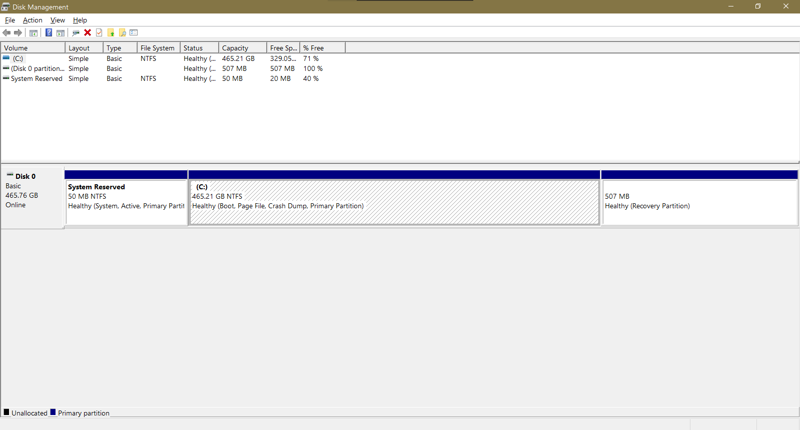
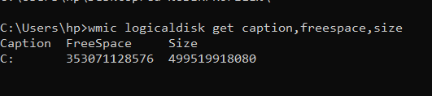
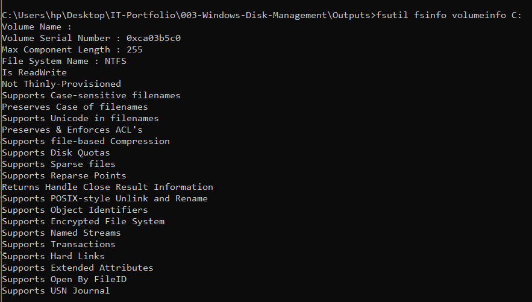
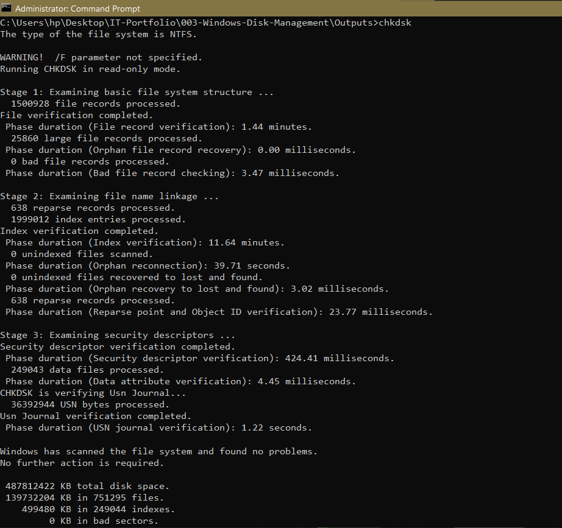
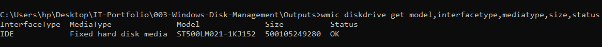
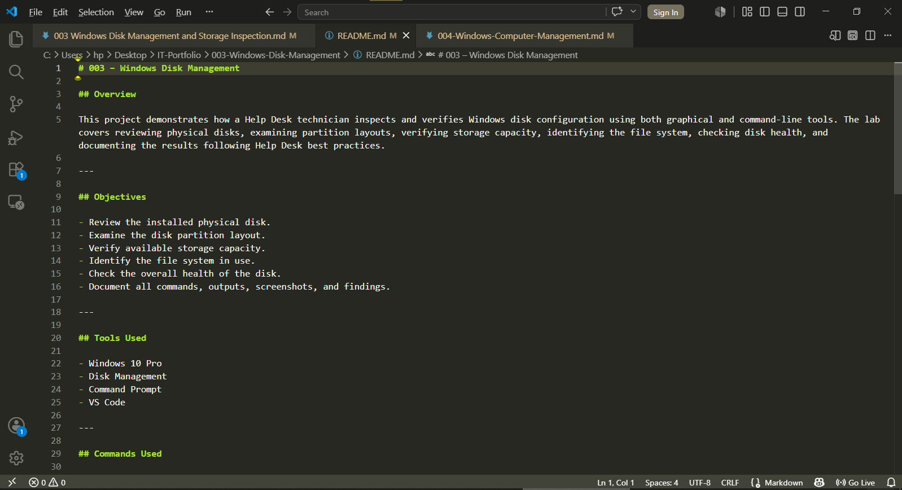

# 003 – Windows Disk Management

## Scenario

A Windows workstation is reported to be running low on available storage space.

Before making any storage-related changes, the IT Support technician must inspect the physical disk, review the partition layout, verify available storage capacity, identify the file system, assess disk health, and document the current disk configuration.

---

## Objectives

- Review the installed physical disk.
- Examine the disk partition layout.
- Verify available storage capacity.
- Identify the file system in use.
- Check the overall health of the disk.
- Document all commands, outputs, screenshots, and findings.

---

## Tools Used

- Disk Management
- Command Prompt
- Windows 10 Pro
- Visual Studio Code

---

## Task 1 — Review Physical Disk and Partition Layout

### Tool

Disk Management

### Purpose

Inspect the installed physical disk, review partition layout, and verify the current storage configuration.

### Evidence

**Output File**

- [01-disk-overview.txt](../Outputs/01-disk-overview.txt)

**Screenshot**



### Result

Successfully reviewed the installed physical disk and verified the partition layout. The workstation contains one healthy physical disk with the required Windows partitions.

---

## Task 2 — Verify Disk Capacity

### Command

```cmd
wmic logicaldisk get caption,freespace,size
```

### Purpose

Determine the total storage capacity and available free space of the logical drives.

### Evidence

**Output File**

- [02-disk-capacity.txt](../Outputs/02-disk-capacity.txt)

**Screenshot**



### Result

Successfully verified the total storage capacity and available free space for the Windows partition.

---

## Task 3 — Verify the File System

### Command

```cmd
fsutil fsinfo volumeinfo C:
```

### Purpose

Identify the file system used by the Windows operating system partition.

### Evidence

**Output File**

- [03-file-system-info.txt](../Outputs/03-filesystem-info.txt)

**Screenshot**



### Result

Confirmed that the Windows operating system partition is formatted using the NTFS file system.

---

## Task 4 — Perform a Disk Health Check

### Command

```cmd
chkdsk
```

### Purpose

Verify the integrity of the file system and detect potential disk errors.

### Evidence

**Output File**

- [04-disk-health.txt](../Outputs/04-disk-health.txt)

**Screenshot**



### Result

Successfully completed a disk health check. No file system errors or disk integrity issues were detected.

---

## Task 5 — Review Physical Disk Hardware

### Command

```cmd
wmic diskdrive get model,interfacetype,mediatype,size,status
```

### Purpose

Identify the installed physical disk hardware and verify its operational status.

### Evidence

**Output File**

- [05-disk-hardware.txt](../Outputs/05-disk-hardware.txt)

**Screenshot**



### Result

Successfully identified the installed storage device. The physical disk status was reported as **OK**, indicating normal operation.

---

## Findings

- One physical hard disk was detected.
- The disk is online and operating normally.
- The partition layout was successfully verified.
- The Windows partition uses the NTFS file system.
- Available storage capacity was successfully documented.
- Disk health verification completed successfully.
- The workstation storage configuration met the baseline requirements.

---

## Lessons Learned

- Learned how to inspect physical disks using Disk Management.
- Learned how to identify Windows partitions and their purposes.
- Learned how to verify storage capacity using Command Prompt.
- Learned how to identify the Windows file system.
- Learned how to perform a basic disk health assessment.
- Improved Windows storage management and technical documentation skills.

---

## Recommendations

- Monitor available disk space regularly.
- Perform routine disk health checks.
- Remove unnecessary files when storage becomes limited.
- Avoid modifying partitions without verified backups.
- Document disk configurations before making storage-related changes.

---

## Skills Demonstrated

- Windows Administration
- Disk Management
- Storage Management
- NTFS File System
- Disk Health Verification
- Command Prompt
- Technical Documentation
- Markdown
- Visual Studio Code

---

## Project Structure

```text
Documentation/
Outputs/
Screenshots/
README.md
```

---

## Project Documentation



---

**Project Status:** ✅ Complete