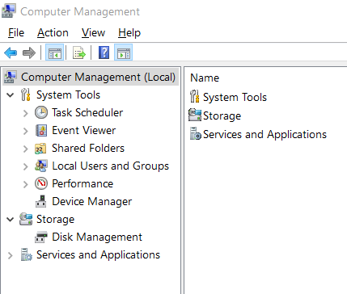
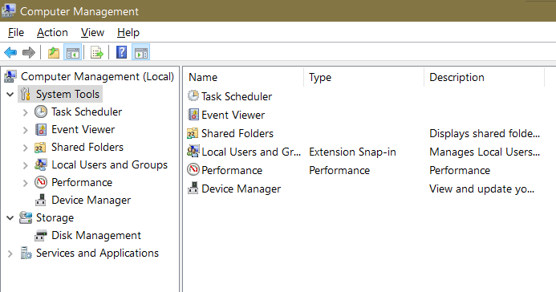
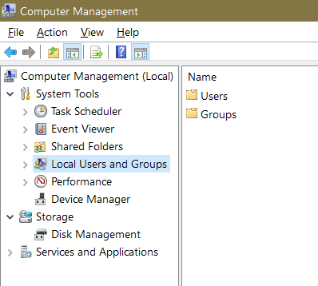
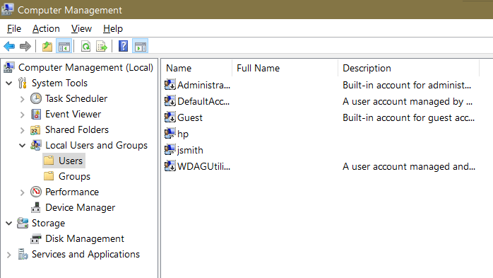
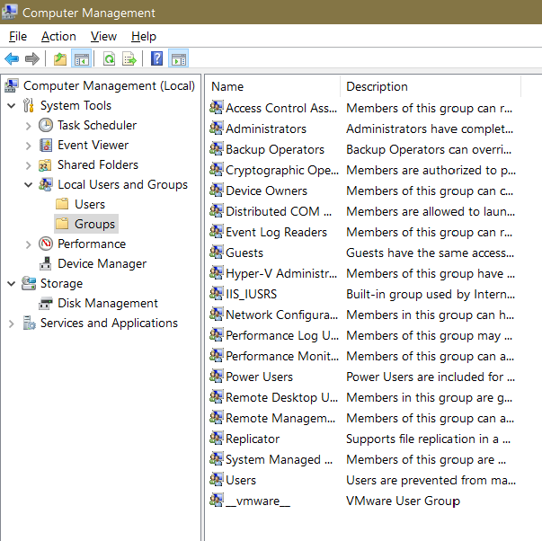
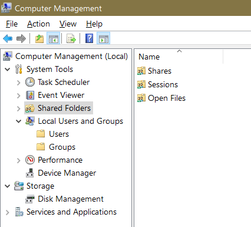
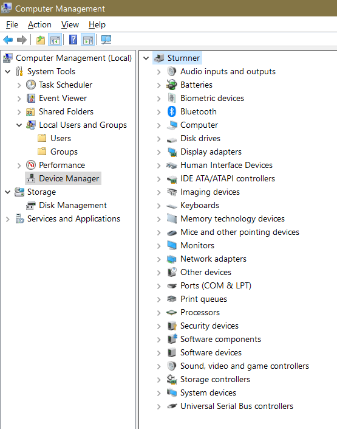
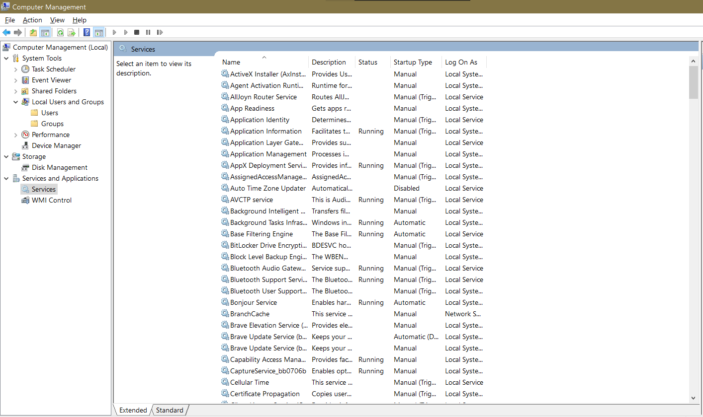

# 004 – Windows Computer Management

## Scenario

A newly deployed employee workstation needs to be reviewed before being handed over to the user. The IT Support technician must use Computer Management to inspect the system, verify local administrative tools, and ensure the workstation is properly configured.

---

## Objectives

- Navigate the Computer Management console.
- Review System Tools.
- Review Shared Folders.
- Review Local Users and Groups.
- Review Device Manager.
- Review Disk Management.
- Review Windows Services.
- Document findings with screenshots and command outputs where applicable.

---

## Tools Used

- Computer Management (compmgmt.msc)
- Command Prompt
- Windows 10 Pro
- VS Code

---

## Task 1 — Open Computer Management

### Tool

Computer Management (compmgmt.msc)

### Purpose

Verify access to the Computer Management console.

### Evidence

**Output File**

N/A (GUI-based task)

**Screenshot**

### Result

Successfully accessed the Computer Management console. All administrative management categories were available without errors.
---

## Task 2 — Review System Tools

### Inspect

- Event Viewer
- Shared Folders
- Local Users and Groups
- Performance
- Device Manager

### Tool

Computer Management → System Tools

### Purpose

Understand how Windows organizes administrative tools.

### Evidence

**Output File**

N/A (GUI-based task)

**Screenshot**

### Result

Successfully reviewed the System Tools section. Administrative utilities including Task Scheduler, Event Viewer, Shared Folders, Local Users and Groups, Performance, and Device Manager were present and accessible.

---

## Task 3 — Review Local Users and Groups

### Tool

Computer Management → Local Users and Groups

### Purpose

- Verify existing local users.
- Verify Administrators group.
- Review built-in Windows accounts.

### Evidence

**Output File**

* [Local User Review](../Outputs/03-local-users-review.txt)
* [Administrators Group Review](../Outputs/03-administrators-group-review.txt)

**Screenshot**

### Result

Successfully reviewed the Local Users and Groups console. Verified the presence of built-in local user accounts and security groups. Confirmed that the Administrators group exists and no unexpected local accounts were identified.

---

## Task 4 — Review Shared Folders

### Identify

- Shares
- Sessions
- Open Files

### Tool

- Computer Management → Shared Folders
- Command Prompt

### Purpose

Review shared folders, active sessions, and open files to verify whether resources are being shared across the local network.

### Evidence

**Output File**

- [Shared Folders](../Outputs/04-net-share.txt)
- [Sessions](../Outputs/04-net-session.txt)
- [Open Files](../Outputs/04-open-files.txt)

**Screenshot**

### Result

Reviewed local shared folders, sessions, and open files. No unexpected shared resources or active network sessions were observed.

---

## Task 5 — Review Device Manager

### Check for

- Unknown devices
- Driver issues
- Hardware status

### Tool

- Computer Management → Device Manager
- Command Prompt

### Purpose

Inspect installed hardware devices, verify driver status, and identify any hardware-related issues.

### Evidence

**Output File**

- [Installed Drivers](../Outputs/05-driverquery.txt)

**Screenshot**

### Result

Reviewed installed hardware devices using Device Manager. No unknown devices, driver errors, or hardware warning indicators were detected.

---

## Task 6 — Review Windows Services

### Identify examples such as:

- Windows Update
- Print Spooler
- Windows Defender
- DHCP Client

### Tool

- Computer Management → Services
- Command Prompt

### Purpose

Inspect essential Windows services and verify that important system services are running correctly.

### Evidence

**Output File**

- [Windows Services](../Outputs/06-services.txt)
- [Running Services](../Outputs/06-running-services.txt)

**Screenshot**

### Result

Reviewed essential Windows services. Core system services including Windows Update, DHCP Client, Print Spooler, and Windows Defender were available and operating normally.

---

## Task 7 — Document Findings

### Purpose

Summarize the overall workstation health after reviewing all administrative components.

### Result

The workstation was successfully inspected using Computer Management. Administrative tools, user accounts, shared resources, hardware devices, and Windows services were reviewed and documented. No critical configuration or operational issues were identified.

---

## Findings

- Successfully accessed the Computer Management console.
- Verified all System Tools were available.
- Reviewed local user accounts and administrator groups.
- Confirmed no unexpected shared resources or active sessions.
- Verified installed hardware devices were operating normally.
- Reviewed essential Windows services.
- No critical workstation configuration issues were identified.

## Lessons Learned

- Learned how Computer Management centralizes Windows administrative tools.
- Learned how to inspect local users and administrator groups.
- Learned how to review Windows services.
- Learned how to identify hardware issues using Device Manager.
- Improved familiarity with Microsoft Management Console (MMC).
- Learned how to navigate and use the Microsoft Management Console (MMC) to administer Windows workstations.

## Recommendations

- Periodically review Windows services.
- Remove or disable inactive local accounts when no longer required.
- Keep hardware drivers updated.
- Investigate any Device Manager warning icons immediately.
- Document administrative changes before deployment.

---

## Skills Demonstrated

- Windows Administration
- Microsoft Management Console (MMC)
- Administrative Tools
- Local User Management
- Windows Services
- Device Management
- Hardware Troubleshooting
- Command Prompt
- Technical Documentation

---

**Project Status:** ✅ Complete
