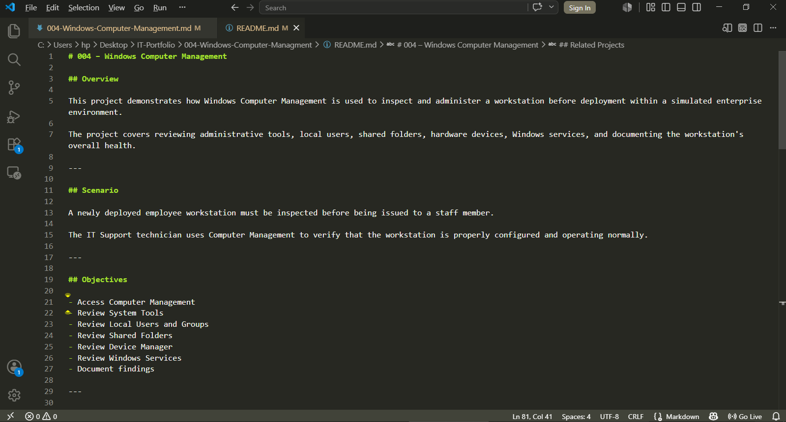

# 004 – Windows Computer Management

## Scenario

A newly deployed employee workstation must be reviewed before being assigned to an end user.

The IT Support technician is responsible for using Computer Management to inspect the workstation, verify local administrative tools, review user accounts, inspect shared resources, verify hardware status, review Windows services, and document the workstation configuration.

---

## Objectives

- Access the Computer Management console.
- Review Windows administrative tools.
- Inspect Local Users and Groups.
- Review Shared Folders.
- Verify installed hardware.
- Review Windows Services.
- Document all commands, outputs, screenshots, and findings.

---

## Tools Used

- Computer Management (compmgmt.msc)
- Command Prompt
- Windows 10 Pro
- Visual Studio Code

---

## Task 1 — Open Computer Management

### Tool

Computer Management (compmgmt.msc)

### Purpose

Verify access to the Computer Management console.

### Evidence

**Output File**

- N/A (GUI-based task)

**Screenshot**


### Result

Successfully accessed the Computer Management console. All administrative management categories were available without errors.

---

## Task 2 — Review System Tools

### Tool

Computer Management → System Tools

### Purpose

Review the Windows administrative tools available within the Microsoft Management Console (MMC).

### Evidence

**Output File**

- N/A (GUI-based task)

**Screenshot**


### Result

Successfully reviewed the System Tools section. Administrative utilities including Task Scheduler, Event Viewer, Shared Folders, Local Users and Groups, Performance, and Device Manager were present and accessible.

---

## Task 3 — Review Local Users and Groups

### Tool

Computer Management → Local Users and Groups

### Purpose

Review existing local user accounts, built-in accounts, and administrator group membership.

### Evidence

**Output Files**

- [03-local-users-review.txt](../Outputs/03-local-users-review.txt)
- [03-administrators-group-review.txt](../Outputs/03-administrators-group-review.txt)

**Screenshots**


### Result

Successfully reviewed local user accounts and security groups. Verified that the Administrators group exists and no unexpected local accounts were identified.

---

## Task 4 — Review Shared Folders

### Tool

- Computer Management → Shared Folders
- Command Prompt

### Purpose

Review shared folders, active sessions, and open files to verify that no unexpected resources are being shared across the workstation.

### Evidence

**Output Files**

- [04-net-share.txt](../Outputs/04-net-share.txt)
- [04-net-session.txt](../Outputs/04-net-session.txt)
- [04-open-files.txt](../Outputs/04-open-files.txt)

**Screenshot**


### Result

Reviewed shared folders, active sessions, and open files. No unexpected shared resources or active network sessions were detected.

---

## Task 5 — Review Device Manager

### Tool

- Computer Management → Device Manager
- Command Prompt

### Purpose

Inspect installed hardware devices and verify that all drivers are functioning correctly.

### Evidence

**Output File**

- [05-driverquery.txt](../Outputs/05-driverquery.txt)

**Screenshot**


### Result

Successfully reviewed installed hardware devices. No unknown devices, driver failures, or hardware warning indicators were detected.

---

## Task 6 — Review Windows Services

### Tool

- Computer Management → Services
- Command Prompt

### Purpose

Review essential Windows services and verify that critical services are operating normally.

### Evidence

**Output Files**

- [06-services.txt](../Outputs/06-services.txt)
- [06-running-services.txt](../Outputs/06-running-services.txt)

**Screenshot**


### Result

Reviewed essential Windows services. Core services including Windows Update, DHCP Client, Print Spooler, and Microsoft Defender were operating normally.

---

## Findings

- Successfully accessed the Computer Management console.
- Verified all Windows administrative tools were available.
- Reviewed local user accounts and administrator groups.
- Confirmed there were no unexpected shared resources or active sessions.
- Verified installed hardware devices were operating normally.
- Reviewed essential Windows services.
- The workstation met the baseline administrative requirements for deployment.

---

## Lessons Learned

- Learned how Microsoft Management Console (MMC) centralizes Windows administrative tools.
- Learned how to inspect local users and administrator groups.
- Learned how to review shared resources.
- Learned how to inspect installed hardware using Device Manager.
- Learned how to review essential Windows services.
- Improved Windows administration and technical documentation skills.

---

## Recommendations

- Periodically review Windows services.
- Remove or disable inactive local accounts.
- Keep hardware drivers up to date.
- Investigate Device Manager warning indicators immediately.
- Document administrative changes before deployment.

---

## Skills Demonstrated

- Windows Administration
- Microsoft Management Console (MMC)
- Administrative Tools
- Local User Management
- Windows Services
- Device Management
- Hardware Troubleshooting
- Command Prompt
- Technical Documentation
- Markdown
- Visual Studio Code

---

## Project Structure

```text
Documentation/
Outputs/
Screenshots/
README.md
```

---

## Project Documentation



---

**Project Status:** ✅ Complete